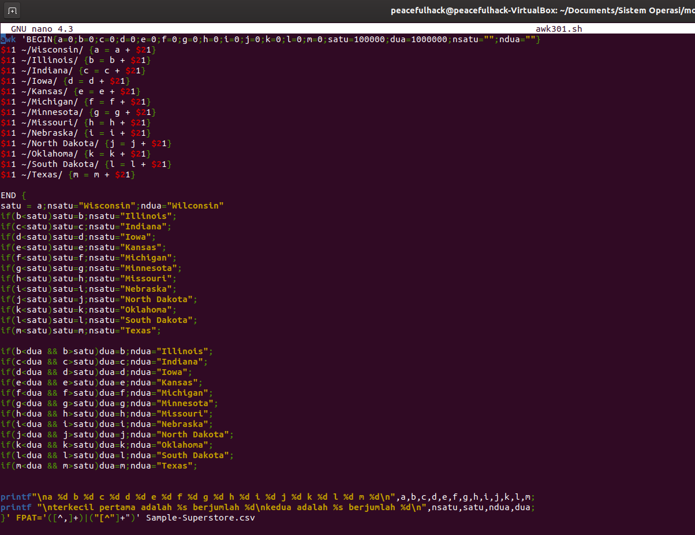

# Penjelasan dan Penyelesaian Soal Shift 1 Sistem Operasi
disusun oleh: M. Mikail Dwi Khusnanda (028) & Ghifari Akbar

# Soal Nomer 1a
<h2>1. Penjelasan</h2>
pada poin a, menentukan wilayah bagian (region) mana yang memiliki keuntungan (profit) paling
sedikit dengan data yang sudah disajikan. dengan menggunakan AWK.
dalam hal ini, mahasiswa diharapkan sudah mengetahui tentang
<ul>
  <li>bash</li>
  <li>AWK</li>
  <li>Gawk</li>
</ul>
dengan cara menjumlahkan profit dari region yang sama, lalu membandingkan sampai dapat region dengan keuntungan paling sedikit.

<h2>2. Penyelesaian</h2>

dalam script diatas, pertama masukkan awk untuk mengidentifikasi bahwa yang kita jalankan adalah dapur perinta awk. lalu mengetikkan "BEGIN" yang mana begin adalah script yang dilakukan sekali dan pertama kali. dan kami isi dengan mendeklarasikan perintah. lalu pada bagian tengah, yaitu bagian yang dijalankan berulang ulang, kami memasukkan satu satu, jika row 13 adalah (Central/West/South/East) maka menjalankan:

<h6>a = a + row 21(profit)</h6>
sebenarnya bisa menggunakan a+=row 21, namun agar mudah dimengerti, kami lebih memilih cara bisasa, yaitu a = a+ row 21 Pada bagian end, kami menggunakan pendeteksi biasa, jika central kurang dari west south dan east maka print central, dan seterusnya.

<h6>FPAT='([^,]+)|("[^"]+")'</h6>

digunakan ketika kita memerlukan separator dengan kondisi, disini kita menggunakan separator "," namun tanda koma didalam petik, tidak sebagai separator melainkan sebuah nama satu kesatuan, maka kita tulis seperti diatas. yang terakhir adalah setelah ditulis semua, jangan lupa menuliskan dataset yang akan kita ambil, disini contohnya adalah Sample-Superstore.csv

<h2>Kesulitan</h2>
karena kami sebelumnya belum sering menggunakan Terminal Linux, kami memiliki banyak kesulitan, pertama yaitu sintax dari AWK sendiri, yang mana menurut kami aneh dengan adanya begin, lalu bagian tengah, dan end. lalu yang kedua adalah kesulitan dengan suatu variable pada $21 yang berisi  1000 box/pcs yang mana itu bukanlah profit, setelah mencari, kami menemukan bahwa ada tanda koma didalam tanda petik yang seharusnya bukan separator, lalu setelah mencari, kami menemukan FPAT. setelah mencoba FPAT, tetap sama, tidak bisa menignore koma didalam petik, selang 1 hari, kami menemukan bahwa FPAT dapat digunakan jika Gawk di install pada linux, setelah itu, kami mengalami kemajuan, yang tadinya tidak bisa mendeteksi menjadi bisa, lalu untuk kendala terakhir adalah, saya tidak tahu bagaimana cara baca FPAT tersebut, mungkin sampai tugas ini terkumpul, mungkin saya belum memahaminya.

# Soal Nomor 1b
<h2>1. Penjelasan</h2>
pada poin b, menampilkan 2 negara bagian (state) yang memiliki keuntungan (profit) paling sedikit berdasarkan hasil poin a dimana sudah diketahui poin a hasilnya adalah central, lalu kita harus mencari, disini, karena saya belum mendalami, saya menggunakan cara manual biasa, dengan menginputkan negara bagian yang memiliki region central. dan menghitung seperti poin a.

<h2>2. Penyelesaian</h2>

pertama, sama seperti poin a, dimana begin saya gunakan untuk deklarasi variable, lalu pada main nya, saya isi dengan matching value tiap negara bagian, lalu penambahan yang sama dengan poin a, dan pada end, dilakukan perkondisian dimana jika kurang dari "satu" dimana satu adalah nilai terkecil, dan dua adalah nilai terkecil kedua, dan nsatu adalah nama nilai terkecil, dan ndua adalah nama nilai terkecil kedua.
pada if jika nilai lebih kecil dari nilai yang sudah ada pada satu, maka dua = satu dan satu = nilainya, dan sama pula untuk nama tiap variable nya.
lalu prinf pertama untuk saya mengecek, prinf kedua untuk nilai pasti terkecilnya

hasilnya:
terkecil pertama adalah Texas berjumlah -24798
kedua adalah Illinois berjumlah -11559

<h2>Kesulitan</h2>
dari script saya sendiri paham bahwa script saya tidak efektif, tidak responsif dan rawan error.

<h4>*Update</h4>

Ternyata saya bisa menemukan solusi lain setelah mencari cari, menggunakan array, untuk begin sama, untuk deklarasi var, lalu pada main nya, saya isi memasukkan kolom 11 yang kolom 13 nya adalah central, lalu menghitung menggunakan += profitnya, yaitu kolom 21.
lalu pada end, menggunakan for 2 kali untuk mengetahui yang paling sedikit pertama dan kedua, yang pertama di loop dulu, setelah ketemu, yang kedua di loop, loopnya menggunakan jika nilai pertama lebih kecil dari profit var itu, maka masukkan nilai dan nama var itu ke "pertama" atau discript bernama "satu" untuk nilai dan "nsatu" untuk nama var nya, yang kedua sama namun kondisinya ditambah "dan lebih besar dari (satu)"

<h2>Source</h2>
https://unix.stackexchange.com/questions/242946/using-awk-to-sum-the-values-of-a-column-based-on-the-values-of-another-column

# Soal Nomor 1c
<h2>1. Penjelasan</h2>
dalam soal 1c, menampilkan 10 produk (product name) yang memiliki keuntungan (profit) paling sedikit berdasarkan 2 negara bagian (state) hasil poin b, dimana hasil poin b adalah Texas dan Ilinois, menggunakan cara yang lebih sederhana namun lebih kompleks hehe~, dengan menggunakan array, sort dan head untuk membatasi output, tanpa mendeklarasikan variable.

<h2>2. Penyelesaian</h2>

dalam script diatas, menggunakan if yang sama seperti nomor 1b, dengan kondisi "atau", dan di END, menggunakan for untuk print angka dulu baru nama, lalu kita pipe dengan sort lalu pipe lagi dengan head, sort -g adalah sorting bilangan, jika tidak ada, maka minus dan tidak menjadi satu (1,-1,-1,2,3,-3...) yang harusnya (-3,-1,-1,1,2,3..) dan "head -n" n disini adalah line nya, berapa jumlah line dari head yang akan ditampilkan, karena dibutuhkan 10, maka head -n 10

<h2>Kesulitan</h2>
-
<h2>Source</h2>
https://superuser.com/questions/264442/how-do-i-limit-the-number-of-displayed-lines-through-ls
